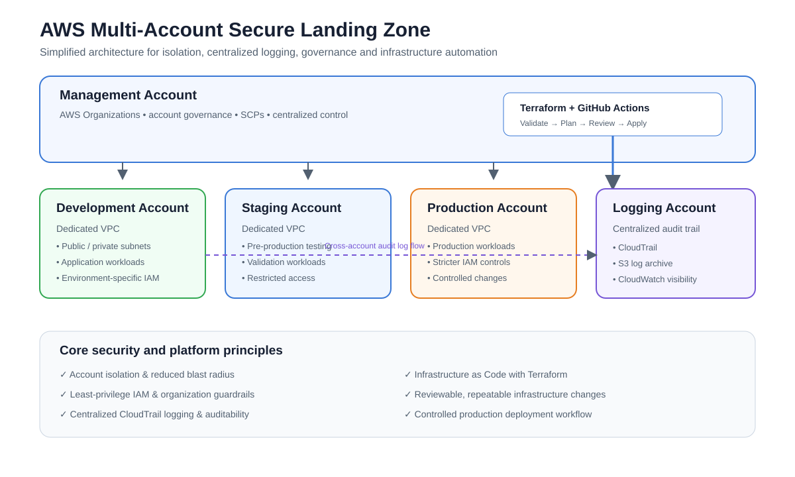

# AWS Multi-Account Secure Landing Zone


> A simplified AWS landing-zone architecture demonstrating how I would structure multiple AWS accounts, isolate environments, centralize audit logging, and manage infrastructure changes with Terraform and GitHub Actions.

---

## Architecture at a glance



The design separates development, staging, and production into dedicated AWS accounts under AWS Organizations. A dedicated logging account receives centralized CloudTrail activity, while Terraform and GitHub Actions provide a repeatable infrastructure workflow.

> **Note:** This repository is an architecture/design demonstration rather than a claim that all of the infrastructure shown is currently deployed. The goal is to demonstrate the design decisions, security model, and operational thinking behind an enterprise-style AWS foundation.

---

## Key design decisions

| Area | Design | Why |
|---|---|---|
| Account structure | Separate Dev, Staging, Production and Logging accounts | Limits blast radius and improves environment isolation |
| Governance | AWS Organizations | Central account management and policy enforcement |
| Networking | Dedicated VPCs per environment | Keeps workloads and network boundaries isolated |
| Logging | Central logging account with CloudTrail + S3 | Creates a consistent audit trail across accounts |
| Identity | IAM roles + least privilege | Limits unnecessary permissions |
| Infrastructure | Terraform | Version-controlled, repeatable infrastructure changes |
| Delivery | GitHub Actions | Automated validation and controlled infrastructure deployment |
| Production changes | Approval before apply | Adds an explicit review point for higher-risk changes |

---

## Account architecture

### Management account

Responsible for organizational governance and account management through AWS Organizations. In a larger implementation, this account would also be used for organization-level policies and guardrails rather than hosting application workloads.

### Development account

Used for development workloads and experimentation. Network and IAM boundaries are kept separate from staging and production.

### Staging account

Provides an environment for validation and pre-production testing without sharing the same account boundary as production.

### Production account

Hosts production workloads with stricter access controls and change-management requirements.

### Central logging account

Receives audit activity from the other accounts. CloudTrail events can be aggregated and retained in S3 so security and operational teams have a centralized source for investigation and compliance evidence.

---

## Security model

The architecture is built around several core cloud-security principles:

- **Account isolation** — separate environments reduce the blast radius of mistakes or compromised credentials.
- **Least-privilege IAM** — users and workloads should receive only the permissions required for their role.
- **Centralized audit logging** — CloudTrail activity is collected into a dedicated logging account.
- **Service Control Policies** — organization-level guardrails can restrict high-risk actions across accounts.
- **Encryption** — sensitive data and log storage should use encryption at rest and in transit.
- **Controlled production access** — production infrastructure changes should be reviewed and approved before deployment.
- **Secure Terraform state** — state should be stored remotely with appropriate access controls and locking rather than committed to Git.

---

## Infrastructure workflow

```text
Developer change
      ↓
Pull request / Git push
      ↓
GitHub Actions
      ↓
Terraform fmt + validate
      ↓
Terraform plan
      ↓
Review / approval
      ↓
Terraform apply
      ↓
AWS environment(s)
```

The intended workflow keeps infrastructure changes reviewable and repeatable. The same Terraform configuration can be used as the foundation for consistent environments while account-specific values and permissions remain isolated.

---

## What this demonstrates

### Cloud architecture

- AWS Organizations and multi-account design
- Environment isolation
- VPC-based network boundaries
- Centralized logging architecture

### Infrastructure as Code

- Terraform-based infrastructure management
- Version-controlled configuration
- Plan-before-apply workflow
- Repeatable environment provisioning

### Security

- Least-privilege IAM
- Centralized CloudTrail logging
- Organization-level guardrails
- Separation of production from lower environments

### Platform / operations thinking

- Reduced blast radius
- Consistent infrastructure changes
- Centralized auditability
- Controlled production deployments
- Clear separation between infrastructure governance and application workloads

---

## Repository structure

```text
AWS-Multi-Account-Secure-Landing-Zone/
├── diagrams/
│   ├── architecture.svg
│   └── architecture.md
└── README.md
```

The repository currently focuses on the architecture and design decisions. The next step would be to implement the design as reusable Terraform modules and automated workflows.

---

## Future implementation

If I expanded this from an architecture demonstration into a deployable landing zone, I would add:

1. Terraform modules for AWS Organizations, accounts, networking, IAM and logging.
2. Remote Terraform state with appropriate locking and access controls.
3. GitHub Actions workflows for formatting, validation, planning and controlled apply.
4. AWS IAM Identity Center for centralized human access.
5. Service Control Policies for organization-wide guardrails.
6. AWS Config / Security Hub for additional security and compliance visibility.
7. CloudWatch monitoring and alerting.
8. Cost controls such as AWS Budgets and account-level tagging standards.
9. Workload deployment pipelines for ECR/ECS or EKS applications.

---

## Why I built this

I wanted to demonstrate that cloud engineering is more than provisioning individual resources. A scalable AWS environment also requires thoughtful account boundaries, security controls, centralized visibility, repeatable infrastructure, and a controlled operational workflow.

This project focuses on those platform-level decisions.

---

## Author

**Tristan Jones**  
Cloud Platform Engineer  
AWS Certified Solutions Architect – Associate  
AWS Certified SysOps Administrator – Associate
