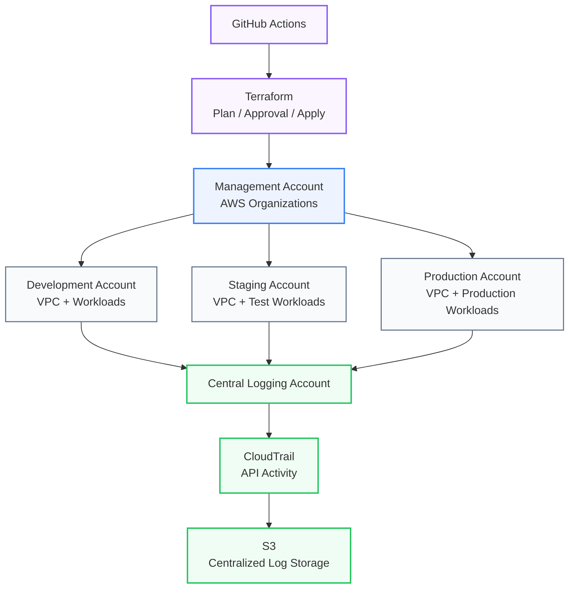

# AWS Multi-Account Secure Landing Zone — Architecture Diagram

## Design intent

- **Management account:** organizational control and account governance.
- **Separate environment accounts:** stronger isolation and reduced blast radius.
- **Central logging:** aggregate CloudTrail activity for auditing and investigation.
- **Terraform:** define infrastructure consistently and review changes before deployment.
- **GitHub Actions:** automate validation, planning, approval, and application of infrastructure changes.
